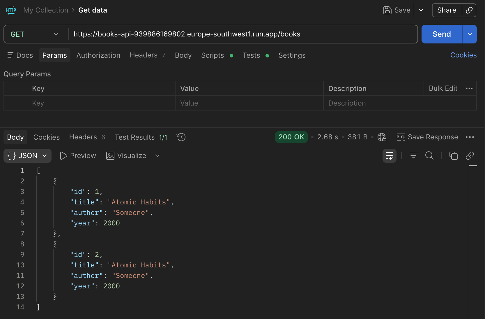

# Lecture 07 Submission Proof

## Cloud Run URL

`https://books-api-939886169802.europe-southwest1.run.app`

## Entity Description

Entity: `Book`

Fields:
- `id`: unique integer ID
- `title`: title of the book
- `author`: name of the author
- `year`: publication year

## Implemented Endpoints

- `POST /books`
- `GET /books/{id}`
- `GET /books`

## Verification Requests

### 1. List All Books

Proof screenshot:

### 2. Create a Book

Proof screenshot:

### 3. Get One Book by ID

Proof screenshot:

## Included Proof Files

- [image copy.png](/Users/montserratcardona/Desktop/programacio/harbour.space_emily/lectures/07/exercises/books_api/image%20copy.png): successful `POST /books`
- [image copy 2.png](/Users/montserratcardona/Desktop/programacio/harbour.space_emily/lectures/07/exercises/books_api/image%20copy%202.png): successful `GET /books/1`
- [image.png](/Users/montserratcardona/Desktop/programacio/harbour.space_emily/lectures/07/exercises/books_api/image.png): successful `GET /books`
